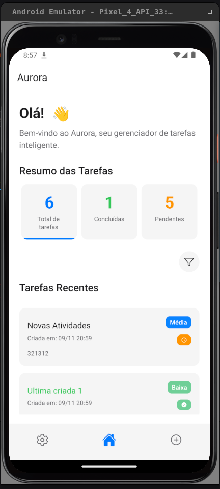
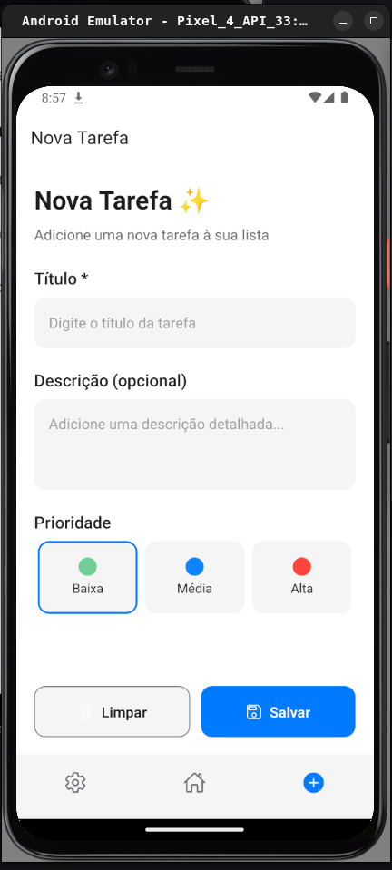
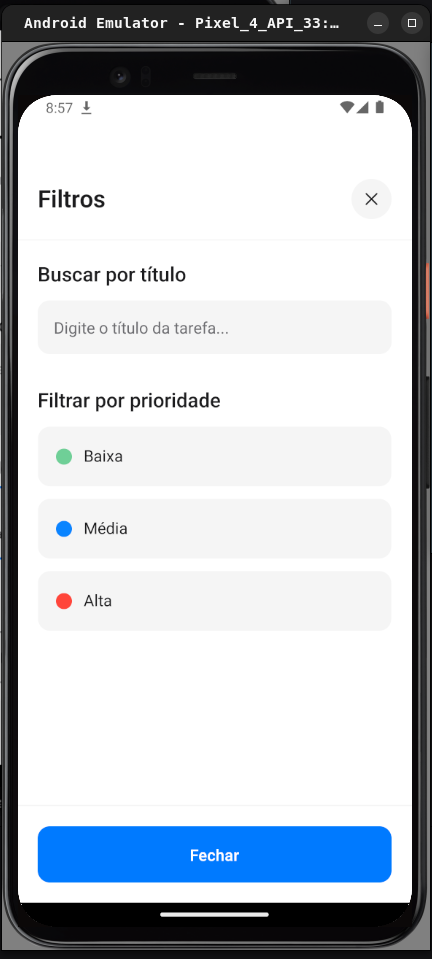
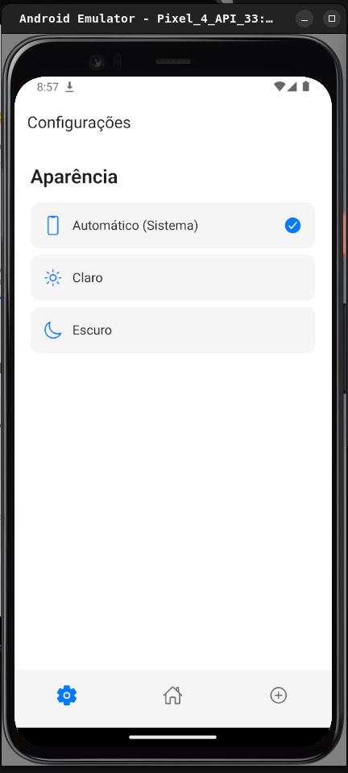

# 📷 Imagens do Aurora Todo App

Este documento apresenta as principais telas e funcionalidades do aplicativo Aurora através de capturas de tela.

## 🏠 Tela Principal (Home)

A tela inicial do Aurora apresenta um dashboard completo com estatísticas de tarefas e listagem interativa.

**Funcionalidades mostradas:**

- Cards de estatísticas (Total, Concluídas, Pendentes) com animação
- Saudação personalizada com animação de mão acenando
- Listagem de tarefas com fade-in
- Botão flutuante para nova tarefa
- Filtros rápidos por status

---

## ➕ Nova Tarefa

Interface intuitiva para criação de novas tarefas com validação em tempo real.

**Funcionalidades mostradas:**

- Campo de entrada com validação
- Seletor de prioridade (Alta/Média/Baixa)
- Botões de ação (Salvar/Cancelar)
- Design consistente com o tema

---

## 🔍 Filtros Avançados

Tela dedicada para filtros e busca, oferecendo controle completo sobre a visualização das tarefas.

**Funcionalidades mostradas:**

- Campo de busca por texto
- Filtros por prioridade
- Filtros por status
- Botões de aplicar e limpar filtros
- Navegação fluida entre telas

---

## ⚙️ Configurações do Sistema

Tela de configurações e preferências do aplicativo.

**Funcionalidades mostradas:**

- Configurações de tema
- Preferências do usuário
- Informações do aplicativo
- Interface limpa e organizada

---

## 📱 Design System

### Paleta de Cores

As imagens demonstram a aplicação consistente do **Dark Theme** do Aurora:

- **Primary**: `#6366F1` - Utilizado nos botões principais e elementos de destaque
- **Success**: `#10B981` - Para tarefas concluídas e ações positivas
- **Warning**: `#F59E0B` - Para prioridades altas e alertas
- **Background**: `#0F0F0F` / `#1A1A1A` - Fundos escuros elegantes
- **Cards**: `#1F1F1F` - Superfícies elevadas com contraste sutil

### Componentes em Ação

As capturas mostram os componentes do design system funcionando em harmonia:

- **Typography**: Hierarquia clara com diferentes pesos e tamanhos
- **Cards**: Elevação sutil com bordas arredondadas
- **Buttons**: Estados visuais claros (normal/pressed/disabled)
- **Badges**: Cores diferenciadas para prioridades e status
- **Icons**: Ionicons consistentes em todo o app

### Animações Capturadas

Embora estáticas, as imagens mostram os estados das animações implementadas:

- **Border Growth**: Cards de estatísticas com border-bottom animado
- **Fade-in**: Lista de tarefas com entrada suave
- **Wave Animation**: Mão acenando na saudação (frame capturado)

---

## 🎯 UX/UI Highlights

### Navegação Intuitiva

- **Bottom Tabs**: Acesso rápido às principais funcionalidades
- **Stack Navigation**: Fluxo natural entre telas
- **Modal Presentation**: Filtros em tela dedicada para melhor foco

### Feedback Visual

- **Loading States**: Indicadores de carregamento onde necessário
- **Empty States**: Mensagens amigáveis quando não há tarefas
- **Success/Error States**: Feedback claro para ações do usuário

### Acessibilidade

- **Contraste**: Cores escolhidas para boa legibilidade
- **Touch Targets**: Áreas de toque adequadas (mínimo 44px)
- **Hierarchy**: Estrutura clara de informações

---

## 📸 Como Capturar Novas Screenshots

Para manter a documentação atualizada, siga estas diretrizes:

1. **Resolução**: Use um dispositivo com resolução consistente
2. **Tema**: Sempre capture no modo Dark Theme
3. **Estado**: Mostre o app com dados realistas, não vazios
4. **Formato**: Salve como PNG para melhor qualidade
5. **Nomenclatura**: Use nomes descritivos (ex: `home_with_tasks.png`)

---

_Última atualização: Novembro 2025_
